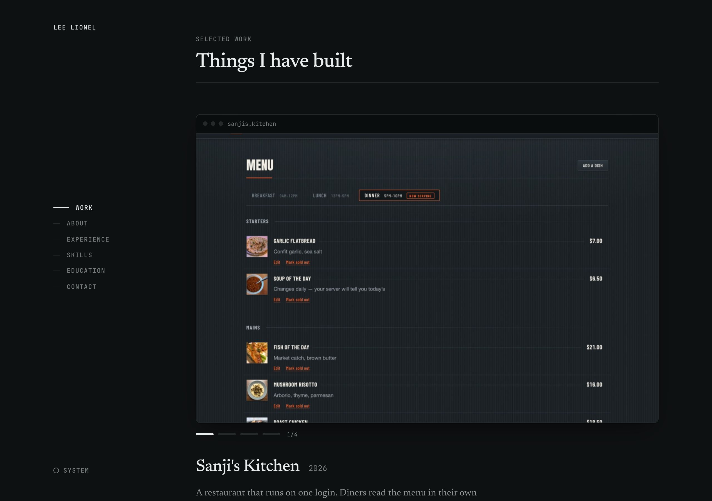
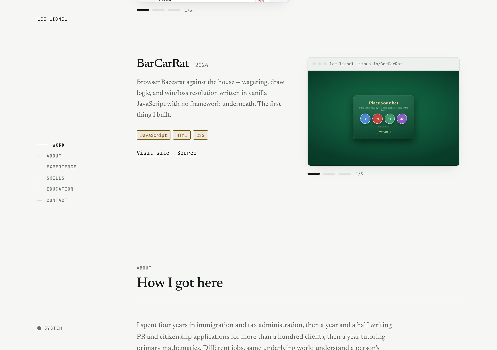
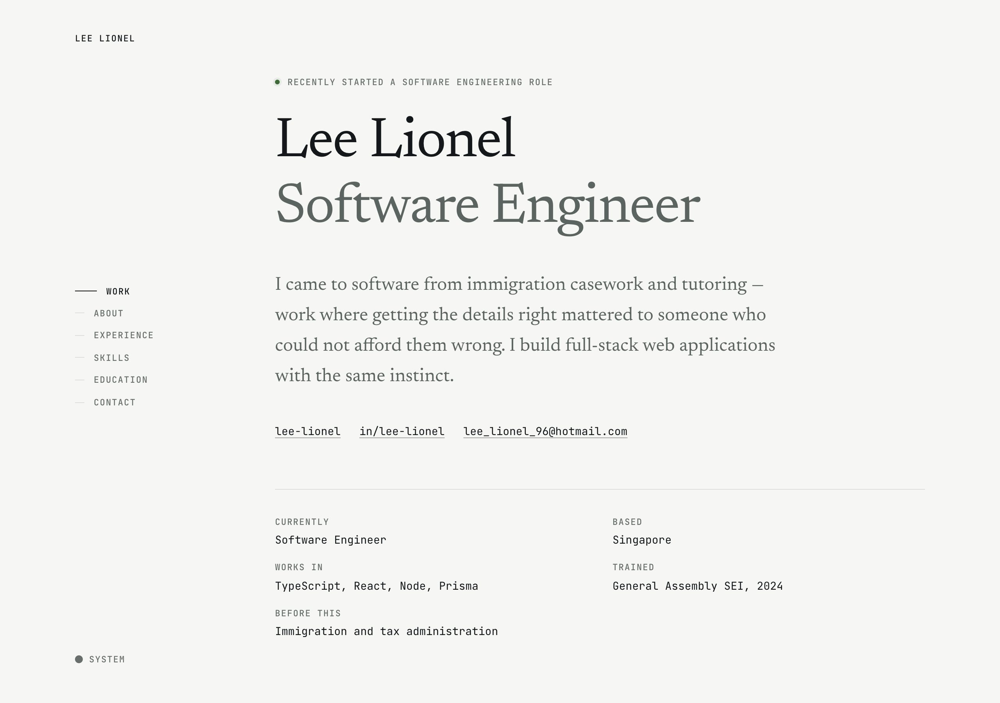

# Portfolio

A résumé you can read — the projects, the experience and the contact details,
all on the page without asking anyone to type a command first.

▶︎ **[lee-lionel.github.io/portfolio](https://lee-lionel.github.io/portfolio/)**


## What it is

Built with Vite, React 19, TypeScript and Tailwind v4. One page, six sections,
and a sticky index that tracks where you are.

It replaced a terminal. That version made the visitor type `experience` or
`ls` to see anything, which meant a recruiter opened it, saw a name and an
empty prompt, and left. The work is the point, so the work leads.

## The design

**Two typefaces, because a résumé is two kinds of writing at once.** Newsreader
carries the narrative — the paragraph about coming to software from immigration
casework. JetBrains Mono carries the record: dates, stacks, labels. The old
version set everything in one monospace face, so nothing had any hierarchy.

**Colour only ever encodes a technology's category.** Language, framework,
data, tooling. There is no separate brand accent competing with it, so a
splash of teal on this page always means "framework" and never means "we felt
like it". Links and focus carry weight and a rule instead.



**Screenshots at size.** They are the only evidence on a portfolio that the
thing was actually built, so each project shows its real screens and you can
page through the states the app genuinely has.

**Experience reads as a ledger** — tabular dates down the left edge, so the
whole history scans in one column.



## Motion

Scroll-linked, and none of it takes the scroll over — a wheel turn moves the
page exactly as far as it always did.

- Screenshots parallax inside their frames. The travel is a percentage of
  plate height rather than a fixed distance: the headroom the scale creates is
  proportional too, so a fixed value tuned on the wide lead plate slid off the
  edge of the small ones.
- The hero drifts and fades as you leave it.
- Section rules draw themselves in as their heading arrives.

Every effect is switched off entirely under `prefers-reduced-motion`, and that
is verified rather than asserted — the tests compare computed transforms at two
scroll positions with the preference set both ways.



## Editing it

`src/data/profile.ts` is the single source of truth — name, thesis, roles,
projects, skills, education, links. Change that file and every section
follows; no component needs touching.

Anything still reading `TODO` is filtered out rather than rendered, so an
unfinished entry never reaches a visitor. That is what the current employer
row is waiting on.

To show a résumé download, put the PDF in `public/` and set `resumeUrl`. It is
deliberately unset: the PDF carries a phone number, and the page withholds
that on purpose.

## Running it

```bash
npm install
npm run dev      # http://localhost:5173
npm run build    # typechecks, then builds to dist/
npm run lint
```

## Deploying

```bash
npm run deploy
```

Builds and pushes to the `gh-pages` branch, which is what GitHub Pages
serves. Pages rebuilds itself a minute or so later.

There is no Actions workflow: adding `.github/workflows/` needs a token with
the `workflow` scope, which this machine's `gh` does not have. The branch
route needs no special scope. If you do add a workflow later, switch the
Pages source back to "GitHub Actions" — otherwise it will keep serving this
branch and ignore the workflow.

Two things a project site needs that are easy to miss:

- `vite.config.ts` sets `base` to `/portfolio/` for builds, because the site
  is served from a subpath rather than a domain root. With `base: '/'` the
  page loads, asks for `/assets/…` at the root, gets a 404, and never boots.
  `npm run deploy` refuses to publish a build missing that prefix.
- Paths in `profile.ts` go through `src/lib/asset.ts`. Vite rewrites asset
  URLs it can see, but those screenshot paths are plain strings, so it cannot
  — they resolved against the domain root, which meant every project
  screenshot 404'd while the page itself looked fine.
