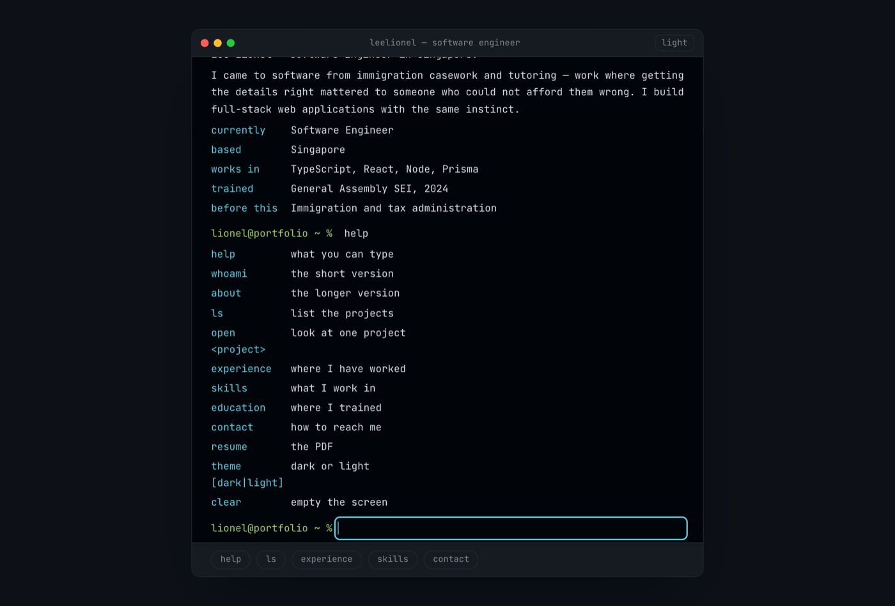
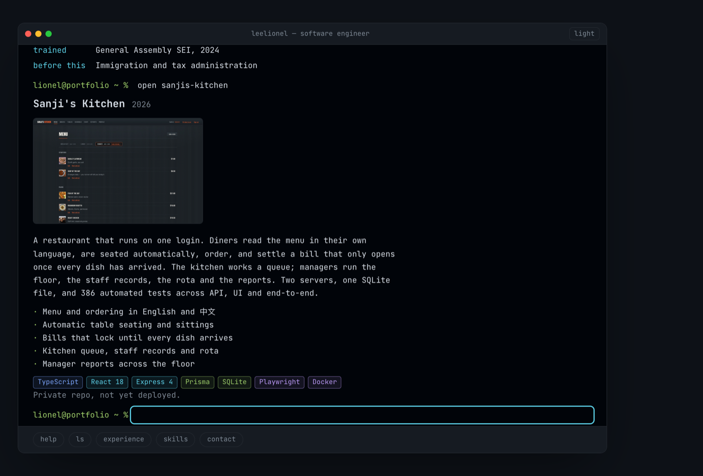
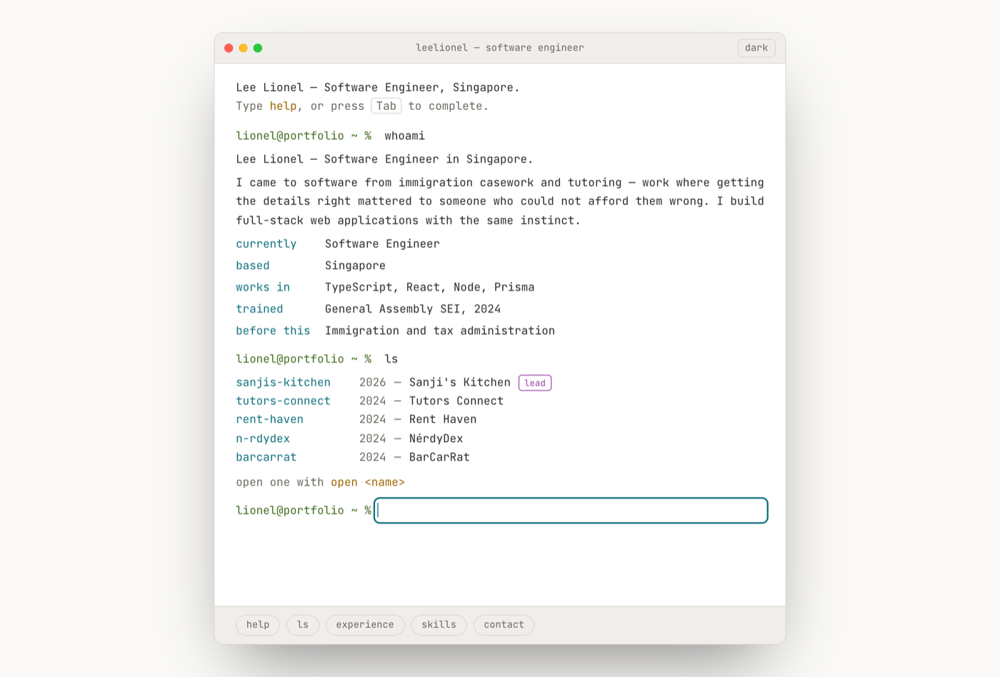

# Portfolio — Lee Lionel

A portfolio you operate rather than scroll. It's a terminal: commands are the
site map.



## Why a terminal

Every earlier pass at this was a scrolling page with a different coat of paint.
The form was the problem, not the palette. A command line suits the subject,
and it is the rare portfolio you actually *use*.

Nobody has to guess how: `whoami` runs on load so the screen is never an empty
prompt, the commands are listed under the input as buttons, and `help` prints
the lot.

## Commands

| Command            | What it does                    |
| ------------------ | ------------------------------- |
| `whoami`           | the short version               |
| `about`            | the longer version              |
| `ls`               | list the projects               |
| `open <project>`   | one project, with screenshots   |
| `experience`       | roles, newest first             |
| `skills`           | grouped, colour-coded           |
| `education`        | schooling                       |
| `contact`          | email, GitHub, LinkedIn         |
| `resume`           | the PDF, once it's published    |
| `theme [dark｜light]` | switch appearance            |
| `clear`            | empty the screen                |

`Tab` completes command names, and project names after `open`. `↑`/`↓` walk
history. `Ctrl-L` clears. There are replies for `sudo`, `rm` and `exit` too.

**Tab only completes when there's something to complete** — on an empty prompt
it moves focus normally, so the terminal is never a keyboard trap.

## Linkable

The URL carries the last command, so any view can be shared:

```
/#open sanjis-kitchen     opens that project
/#contact                 goes straight to contact
```

An unrecognised command falls back to the prompt rather than an empty screen.



## Design

Output is **rendered, not printed as ASCII** — a project shows its real
screenshots, its stack as colour-coded chips, and its links. A screenshot beats
box-drawing characters.

The palette is a terminal colour scheme rather than a UI palette: cyan names
things, green is the prompt and a value, magenta tags, amber warns, red errors.
Dark by default, because that is what a terminal is; light is the same scheme
inverted. Both pass WCAG AA — checked with axe-core, not by eye.

Type is JetBrains Mono throughout, self-hosted, so there are no external font
requests.



## Content

**Everything is in [`src/data/profile.ts`](src/data/profile.ts).** Edit that one
file and every command updates. Anything marked `TODO` is waiting on the résumé.

## Running it

```bash
npm install
npm run dev      # http://localhost:5173
npm run build    # → dist/
```

Pinned to Vite 7: Vite 8 requires Node 20.19+ or 22.12+.

## Layout

```
src/
├── terminal/
│   ├── Terminal.tsx    the shell — history, completion, boot, deep links
│   └── commands.tsx    the command registry and its output
├── data/profile.ts     all the content
├── lib/                theme, tech classification
└── index.css           the colour scheme, and only here
```
